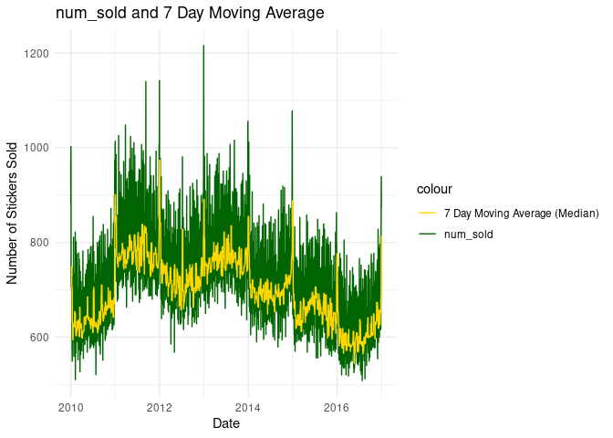
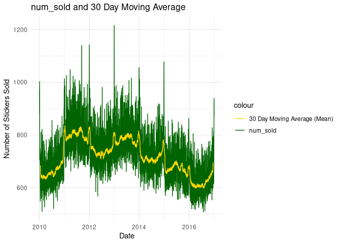

Moving Average in R
================

# Introduction

There has been a lot of discussion about how to deal with missing target
values in this competition. I originally thought that I would use a
moving average to impute these missing values, but it didn’t work so
great, so I will simply use the data from this competition to
demonstrate how to calculate and plot a moving average in R.

## Definition of a Moving Average

    A moving average is the average of X number of days, so it will change each day as time progresses.  Moving averages can be useful in making stock market predictions, as well as in analyzing other economic indicators with a time component.

``` r
# Load packages.
library(dplyr)
```

    ## 
    ## Attaching package: 'dplyr'

    ## The following objects are masked from 'package:stats':
    ## 
    ##     filter, lag

    ## The following objects are masked from 'package:base':
    ## 
    ##     intersect, setdiff, setequal, union

``` r
library(lubridate)
```

    ## 
    ## Attaching package: 'lubridate'

    ## The following objects are masked from 'package:base':
    ## 
    ##     date, intersect, setdiff, union

``` r
library(ggplot2)
library(zoo)
```

    ## 
    ## Attaching package: 'zoo'

    ## The following objects are masked from 'package:base':
    ## 
    ##     as.Date, as.Date.numeric

``` r
# Load data.
train = read.csv('train.csv')

# Convert date from character to date.
train2 = train %>%
  mutate(date = ymd(date))

# Convert country, store, and product from character to categorical.
train3 = train2 %>%
  mutate(country = as.factor(country),
         store = as.factor(store),
         product = as.factor(product))
```

# Moving Average Calculation and Graphing

I will focus on a single combination of country, store, and product. In
this case, the country is Canada, the store is Discount Stickers, and
the product is Kaggle.

``` r
can.dis.kag = train3 %>%
  filter(country == 'Canada',
         store == 'Discount Stickers',
         product == 'Kaggle')
```

To calculate a moving average in R, arrange the data by date, and then
use rollmean() or rollmedian() from the zoo package. k specifies the
number of days over which to average. Setting fill to “extend” allows
the algorithm to search as far back in time as necessary when it
encounters a missing value. In other words, if an NA is encountered, the
algorithm will keep going back (or forward) in time until it finds a
numeric value. Aligning to the right indicates that the current day
should be the last in the average. You can also align left or center.
Here I calculate a 7 day moving average. Since this average is
right-aligned, the first 6 days will have a value of NA. Also note that
if you use median, k will need to be an odd number.

``` r
# Calculate the 7 day moving average.
mov1 <- can.dis.kag %>%
  arrange(date) %>%
  mutate(moving_avg = rollmedian(num_sold, k = 7, fill = NA, align = "right"))
```

Finally, you can plot the moving average using ggplot2. This plot shows
num_sold in green and the moving average (median) in gold.

``` r
# Specify size.
options(repr.plot.width = 20.0, repr.plot.height = 13.3)

# Plot moving average.
mov.plot = ggplot(data = mov1, aes(x = date)) +
  geom_line(aes(y = num_sold, color = "num_sold")) +
  geom_line(aes(y = moving_avg, color = "7 Day Moving Average (Median)")) +
  labs(title = "num_sold and 7 Day Moving Average",
       x = "Date", y = "Number of Stickers Sold") +
  scale_color_manual(values = c("num_sold" = "darkgreen", "7 Day Moving Average (Median)" = "gold")) +
  theme_minimal()

mov.plot
```

    ## Warning: Removed 6 rows containing missing values or values outside the scale range
    ## (`geom_line()`).

<!-- -->

You can also calculate and plot a moving average as the mean instead of
the median, as shown here. This time, I will do a 30 day moving average
and align center to see what that looks like.

``` r
mov2 <- can.dis.kag %>%
  arrange(date) %>%
  mutate(moving_avg = rollmean(num_sold, k = 30, fill = NA, align = "center"))

mov.plot2 = ggplot(data = mov2, aes(x = date)) +
  geom_line(aes(y = num_sold, color = "num_sold")) +
  geom_line(aes(y = moving_avg, color = "30 Day Moving Average (Mean)")) +
  labs(title = "num_sold and 30 Day Moving Average",
       x = "Date", y = "Number of Stickers Sold") +
  scale_color_manual(values = c("num_sold" = "darkgreen", "30 Day Moving Average (Mean)" = "gold")) +
  theme_minimal()

mov.plot2
```

    ## Warning: Removed 29 rows containing missing values or values outside the scale range
    ## (`geom_line()`).

<!-- -->
